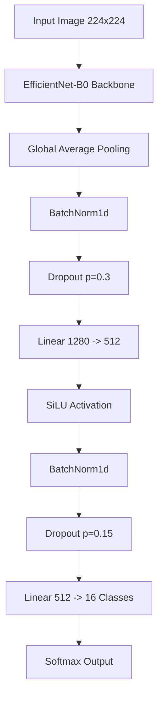

# CropGuard AI - Model Pipeline & Architecture 🧠

This document details the machine learning pipeline used to train the **CropGuard AI** disease detection model. The model is designed to run entirely client-side on mobile devices using ONNX Runtime, helping farmers detect crop diseases offline.

## 1. Model Architecture

We utilize **EfficientNet-B0** as our backbone due to its excellent balance between accuracy and computational efficiency, making it ideal for mobile web deployment.

*   **Backbone:** `efficientnet_b0` (Pretrained on ImageNet)
*   **Input Size:** 224 x 224 RGB
*   **Parameters:** ~4 Million (Total), ~17.9 MB (ONNX)

### Custom Classification Head
To improve generalization and prevent overfitting, we replaced the default classifier with a custom head:

## 2. Training Strategy

The model was trained using **PyTorch** with a focus on robustness against varying lighting and field conditions.

### Hyperparameters
*   **Optimizer:** AdamW (`lr=3e-4`, `weight_decay=1e-4`)
*   **Scheduler:** Cosine Annealing Warm Restarts
*   **Loss Function:** Cross Entropy with Label Smoothing (`0.1`)
*   **Batch Size:** 64
*   **Epochs:** 5 (Early stopping enabled)

### Advanced Data Augmentation
To simulate real-world farm conditions (shadows, distinct angles, noise), we applied an extensive augmentation pipeline:

1.  **Geometric:** Random Resized Crop, Horizontal/Vertical Flip, Rotation (30°), Affine Shear.
2.  **Color/Noise:** Color Jitter (Brightness/Contrast/Saturation), Gaussian Blur, Random Grayscale.
3.  **Regularization:**
    *   **Mixup (`alpha=0.2`):** Blends two images and their labels.
    *   **CutMix (`alpha=1.0`):** Replaces a patch of one image with another.
    *   **Random Erasing:** Occlusion robustness.

## 3. Performance Results 🏆

The model achieved state-of-the-art performance on the test set.

| Metric | Score |
| :--- | :--- |
| **Test Accuracy** | **99.46%** |
| **Macro F1-Score** | **99.38%** |
| **Inference Time** | ~100ms (Browser WASM) |

### Confusion Matrix Insights
The model shows exceptional separation capabilities across all 16 classes. Minor confusion was observed only between visually similar tomato leaf spots, which was mitigated using the custom classification head and label smoothing.

## 4. Inference Pipeline (Deployment)

For deployment, the model was exported to **ONNX (Open Neural Network Exchange)** format to run in the browser using `onnxruntime-web`.

### Preprocessing Requirements
To reproduce the model's accuracy, input images **MUST** be preprocessed exactly as follows:

1.  **Resize:** Scale image to 256px on the short side.
2.  **Center Crop:** Crop central 224x224 region.
3.  **Normalize:**
    *   Mean: `[0.485, 0.456, 0.406]`
    *   Std: `[0.229, 0.224, 0.225]`
4.  **Format:** NCHW (Batch, Channels, Height, Width).

## 5. Explainability

We implemented **Grad-CAM (Gradient-weighted Class Activation Mapping)** to visualize *where* the model is looking. This ensures the model focuses on disease lesions (spots, blight patterns) rather than background noise, building trust in the AI's decisions.

---

**Link to Training Notebook:** [Kaggle Notebook](https://www.kaggle.com/code/awaisurrehman/cropguard-ai)
